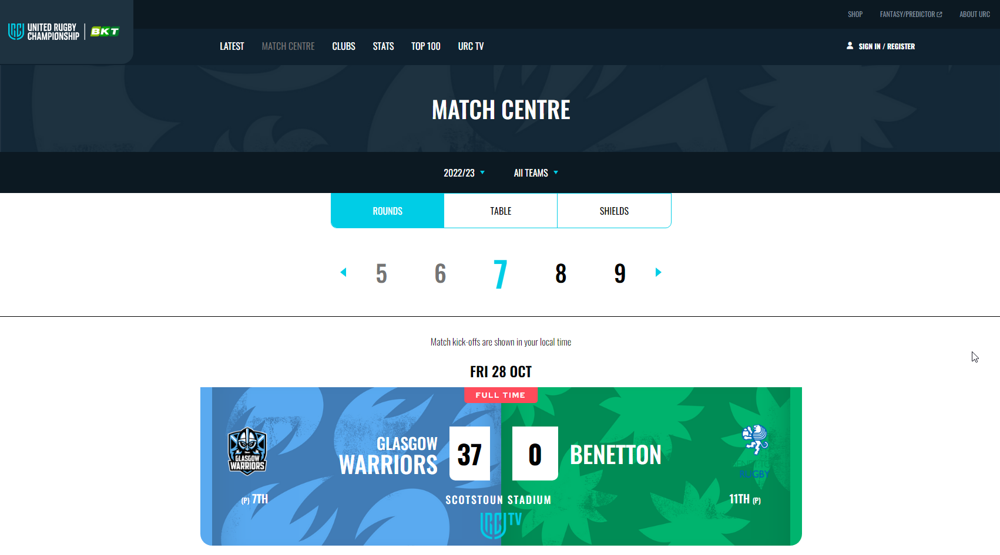

# Rugby-website

## Description

Rugby-website is a clone website part of the challenges of the Italian Frontenders Community. It has been useful to test more advanced CSS in the match cards section and to practice with fetch to JSON file.

## Features

- Fetch from JSON file.
- Website responsive clone with media queries.

## Technology

  
 
  
  

## Demo

To see a live demo of the Rugby-website, visit [Demo](https://www.massidev.com/portfolio/rugby-website/).

## Installation

To run the Rugby-website locally, follow these steps:

1. Clone the repository: `git clone https://github.com/massi-17/rugby-website.git`
2. Navigate to the project directory: `cd rugby-website`
3. Open the `index.html` file in your preferred web browser.

## Contributing

Contributions are welcome! If you want to contribute to this Rugby-website, please follow these steps:

1. Fork the repository.
2. Create a new branch: `git checkout -b feature/your-feature`.
3. Make your changes and commit them: `git commit -m 'Add your feature'`.
4. Push to the branch: `git push origin feature/your-feature`.
5. Submit a pull request.

